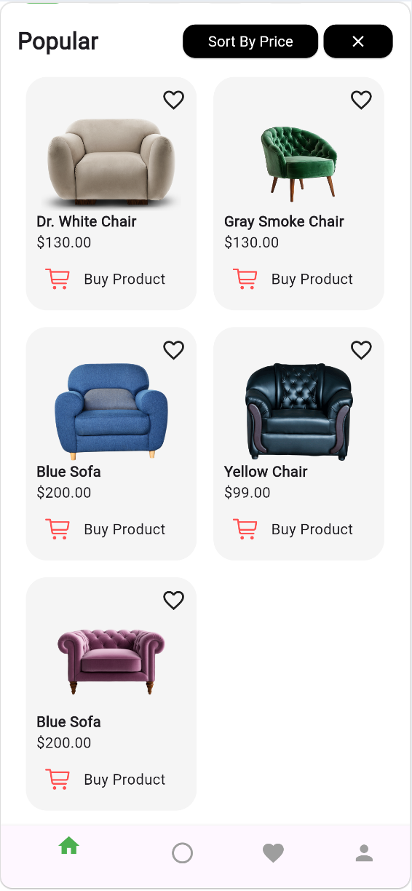
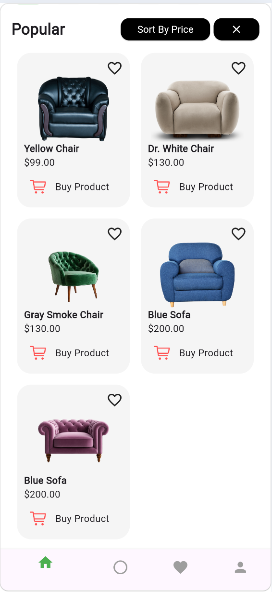
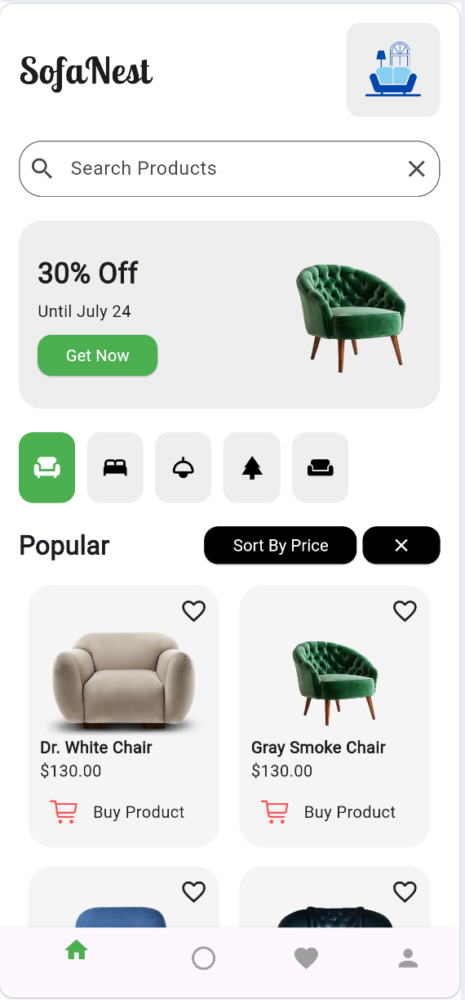
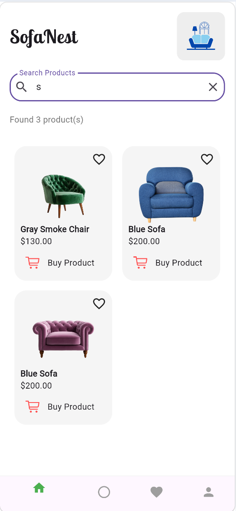

# SofaNest E-commerce Flutter App
- All Features Added:
- Splash screen on app start
- Home / Product page ("SofaNest" branding)
- Responsive layout using MediaQuery for sizing
- Product data stored as in-memory list (name, price, image, target screen)
- Search functionality with:
    - TextField search input
    - Live filtering as user types
    - Clear search button
    - Display of found product count
    - "No products found" UI with icon and guidance text
- Sorting functionality:
    - Sort products by price (ascending)
    - Clear sort (reset to original product order)
- Promotional banner with CTA button that navigates to product screen
- Horizontal category selector (Category widget)
- Product grid (GridView) for displaying products
- Product card (ProductCard widget) features:
    - Product image, name, price
    - Favorite icon placeholder
    - Buy button that navigates to product detail screen
- Multiple product detail screens (Products_Info, Products2_info, product_details, product_details2) linked from product cards
- Bottom navigation bar with:
    - Home navigation
    - Placeholder middle items
    - Favorites icon
    - Profile icon that navigates to Profile screen
- Profile screen (profileScreen.dart)
- Order list screen (orderlist.dart)
- Payment page (PaymentPage.dart)
- Use of Google Fonts (google_fonts package)
- Use of Cupertino icons and Material widgets
- Navigation implemented with Navigator.push and MaterialPageRoute
- State management using StatefulWidget and setState
- Proper controller lifecycle handling (TextEditingController with dispose)
- UI styling: rounded containers, ElevatedButton custom styles, icons, and asset images
- Asset usage for product images and app icon
- Organized file structure under lib/screens:
    - main.dart
    - splash_screen.dart
    - product.dart
    - Products_Info.dart
    - Products2_info.dart
    - product_details.dart
    - product_details2.dart
    - profileScreen.dart
    - orderlist.dart
    - PaymentPage.dart

## Screenshots

### Sorting

  
  

### Searching

  
  

